# 🏗️ Azure Monitor NL-KQL Agent - System Architecture

## High-Level System Design

```mermaid
flowchart TD
    %% User Layer
    USER["👤 User Input<br/>(Natural Language)"]
    
    %% Interface Layer
    subgraph UI["🌐 User Interfaces"]
        WEB["📱 Web UI<br/>Dashboard"]
        CLI["💻 CLI Agent<br/>Terminal"]
        API["🔌 REST API<br/>Integration"]
        MCP["🤖 MCP Server<br/>AI Bridge"]
    end
    
    %% Processing Core
    subgraph CORE["🧠 Processing Core"]
        NL["⚡ NL Engine<br/>Translation"]
        QE["🔍 Query Engine<br/>Execution"]
        SE["📊 Schema Engine<br/>Discovery"]
    end
    
    %% External Services
    subgraph EXT["☁️ External Services"]
        OPENAI["🤖 Azure OpenAI<br/>GPT-4"]
        LOGS["📈 Log Analytics<br/>KQL Execution"]
    end
    
    %% Knowledge Layer
    subgraph KB["📚 Knowledge Base"]
        EXAMPLES["💡 Examples<br/>100+ Patterns"]
        SCHEMAS["🗂️ Schemas<br/>Repository"]
    end
    
    RESULTS["📊 Query Results<br/>(Tables + Charts)"]

    %% Main Flow
    USER --> UI
    UI --> CORE
    CORE --> EXT
    CORE <--> KB
    EXT --> CORE
    CORE --> UI
    UI --> RESULTS
    RESULTS --> USER

    %% Internal Connections
    NL --> OPENAI
    QE --> LOGS
    SE <--> SCHEMAS
    NL <--> EXAMPLES

    %% Large, Readable Styling
    classDef interface fill:#f8f9ff,stroke:#4285f4,stroke-width:3px,font-size:16px,font-weight:bold
    classDef core fill:#fff8f0,stroke:#ff6b35,stroke-width:3px,font-size:16px,font-weight:bold
    classDef external fill:#f0fff0,stroke:#32cd32,stroke-width:3px,font-size:16px,font-weight:bold
    classDef knowledge fill:#fef7ff,stroke:#9c27b0,stroke-width:3px,font-size:16px,font-weight:bold
    classDef userResult fill:#f0f8ff,stroke:#1976d2,stroke-width:4px,font-size:18px,font-weight:bold

    class WEB,CLI,API,MCP interface
    class NL,QE,SE core
    class OPENAI,LOGS external
    class EXAMPLES,SCHEMAS knowledge
    class USER,RESULTS userResult
```

## 🎯 Key Architecture Highlights

### **🚀 Multi-Interface Design**
- **Web UI**: Interactive tables, real-time suggestions, visual query building
- **CLI Agent**: Power users, automation, scripting integration
- **REST API**: Enterprise integration, third-party applications
- **MCP Server**: AI assistant integration (Claude, ChatGPT, etc.)

### **🧠 Intelligent Core Engine**
- **Context-Aware Translation**: Understands workspace schema and user intent
- **Smart Retry Logic**: Automatically fixes common query errors
- **Dynamic Schema Discovery**: Real-time workspace analysis and suggestion generation
- **Pattern Matching**: Combines AI with rule-based optimization

### **☁️ Azure Cloud Integration**
- **GPT-4 Powered**: Advanced natural language understanding
- **Native Azure APIs**: Direct integration with Log Analytics and Monitor
- **Scalable Architecture**: Enterprise-ready with proper error handling

### **📚 Knowledge-Driven Approach**
- **100+ Curated Examples**: Covering Application Insights, Security, Infrastructure
- **NGSchema Integration**: Comprehensive table metadata and relationships
- **Workspace Intelligence**: Context-aware suggestions based on actual data
