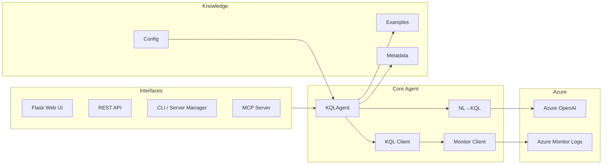
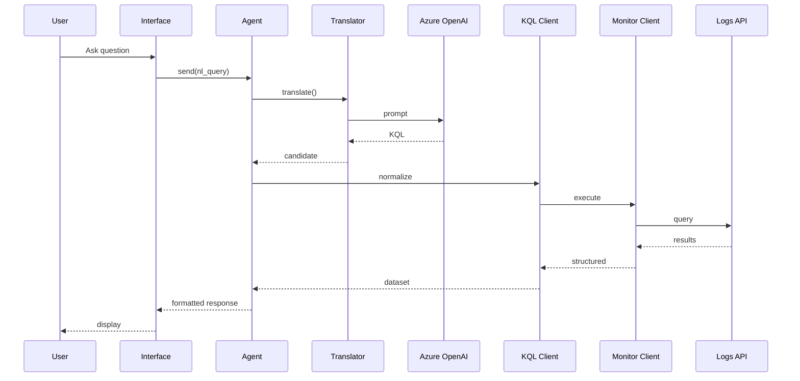

# Azure Monitor MCP Agent

A comprehensive Python agent for querying Azure Monitor Log Analytics using both direct KQL and natural language (NL) questions. Features multiple interfaces including CLI, web UI, REST API, and MCP server integration for AI assistants.

## 🌟 Features
- **Multiple Interfaces**: CLI, Beautiful Web UI, REST API, and MCP Server
- **Natural Language Queries**: Ask questions in plain English, get KQL results
- **Enhanced Table Display**: Beautiful HTML tables with professional styling (NEW!)
- **Smart Retry Logic**: Automatic retries improve translation success rates
- **Smart Timespan Detection**: Automatically handles queries with time filters
- **Example-Driven Translation**: Uses curated KQL examples for accurate translations
- **Azure OpenAI Integration**: Powered by Azure OpenAI with o4-mini model support
- **Real-time Results**: Interactive web interface with live query execution
- **Workspace Management**: Easy setup and connection testing
- **Defensive Error Handling**: Robust error handling and result parsing

## Requirements
- Python 3.8+
- Azure CLI (for authentication)
- Azure Log Analytics Workspace
- Azure OpenAI resource (for NL-to-KQL translation)

## Installation
1. Clone this repository and enter the directory:
   ```powershell
   git clone <your-repo-url>
   cd NoaAzMonAgent
   ```
2. Install dependencies:
   ```powershell
   pip install -r requirements.txt
   ```
3. Set environment variables for Azure OpenAI (see code comments for required variables).

## 🚀 Quick Start

### 1. **Web Interface** (Recommended)
The easiest way to get started with a beautiful, interactive web interface:

```powershell
# Install dependencies
pip install -r requirements.txt

# Launch web interface
python web_app.py
```

Then open your browser to **http://localhost:8080** and enjoy the modern web UI!

**Web Interface Features:**
- 🎨 Beautiful, responsive design
- 💬 Natural language question input
- 🔗 Interactive workspace setup
- 💡 Quick suggestion pills
- 📚 Built-in example queries
- ⚡ Real-time results display
- 🧪 Connection testing

### 2. **Command Line Agent**
For terminal-based interactions:

```powershell
python server_manager.py agent
```

### 3. **Server Interfaces**

#### REST API Server
```powershell
python server_manager.py http
# Available at http://localhost:8080
```

#### MCP Server (for AI assistants like Claude)
```powershell
python server_manager.py mcp
```

## 💻 Usage Examples

### Web Interface
1. Start the web interface: `python web_app.py`
2. Enter your Log Analytics Workspace ID
3. Click "Connect" to setup the workspace
4. Ask questions like:
   - "Show me failed requests from the last hour"
   - "What are the top 5 slowest API calls?"
   - "Get heartbeat data from the last 30 minutes"

### CLI Examples
Run a KQL query directly:
```powershell
python main.py query --workspace-id <WORKSPACE_ID> --query "Heartbeat | take 5"
```

Ask a question in natural language:
```powershell
python main.py query --workspace-id <WORKSPACE_ID> --ask "Show me the total ingestion volume in MB in the last 24 hours"
```

### REST API Examples
```bash
# Execute a KQL query
curl -X POST http://localhost:8080/query \
  -H "Content-Type: application/json" \
  -d '{"workspace_id": "your-workspace-id", "query": "Heartbeat | take 5"}'
```

## 🔧 Setup & Configuration

### Prerequisites
- **Python 3.8+**
- **Azure CLI** (for authentication)
- **Azure Log Analytics Workspace**
- **Azure OpenAI resource** (for natural language translation)

### Installation
1. **Clone and setup:**
   ```powershell
   git clone <your-repo-url>
   cd NoaAzMonAgent
   pip install -r requirements.txt
   ```

2. **Azure authentication:**
   ```powershell
   az login
   ```

3. **Configure Azure OpenAI:**
   ```powershell
   # Copy template and edit with your details
   copy .env.template .env
   # Edit .env with your Azure OpenAI endpoint and API key
   ```

4. **Test setup:**
   ```powershell
   python setup_azure_openai.py
   ```

### Unified Schema Caching & Table Listing (Optional)
The agent can enumerate workspace tables using the official Log Analytics Tables REST API for faster and more complete schema hydration. Provide these environment variables (PowerShell shown):

```powershell
$env:LOG_SUBSCRIPTION_ID = "<subscription-guid>"
$env:LOG_RESOURCE_GROUP  = "<resource-group-name>"
$env:LOG_WORKSPACE_NAME  = "<workspace-resource-name>"  # This is the workspace resource name, not the GUID workspace ID
# Optional: override default 20 minute cache TTL
$env:SCHEMA_TTL_MINUTES  = "20"
```

Behavior:
- If the REST call succeeds, schema source is reported as `rest-api`.
- If REST fails or required vars are missing, it falls back once to a lightweight union query enumeration (`union-query`).
- Results (table list + manifest map) are cached for the TTL to avoid repeated enumeration.

### Workspace Schema (Stateless Fetch Model)
The workspace schema subsystem has been simplified: all requests now perform a **fresh, stateless fetch** using `get_workspace_schema()` with no in‑process cache, no background polling threads, and no refresh flags.

Current Endpoints:
- `GET /api/workspace-schema` – Returns the enriched schema immediately (or an error). Response includes `status="ready"` and enrichment data; pending states were removed.
- `GET /api/workspace-schema-status` – Lightweight stateless check. Returns `status` of `uninitialized`, `ready` (tables found) or `empty` (no tables). No long‑running flags or cached counts.
- `POST /api/refresh-workspace-schema` – Optional direct refetch (primarily for manual user-triggered refreshes); accepts `{ "refetch": true }` body. No background threading.
- `POST /api/clear-workspace-cache` – Kept for backward compatibility; always returns success (cache was removed).

Removed Concepts:
- Background fetch threads & race mitigation loops.
- Refresh flag dictionaries (`_workspace_schema_refresh_flags`, `_workspace_schema_refresh_errors`) and lock.
- Cached workspace schema object & enrichment persistence.

Environment Variables Still Relevant:
- `DOCS_ENRICH_DISABLE=1` – Disable Microsoft Docs enrichment for queries & table metadata.
- `DOCS_META_MAX_SECONDS` – Time budget for metadata enrichment pass.
- `DOCS_ENRICH_MAX_TABLES` / `DOCS_ENRICH_MAX_SECONDS` – Limits for docs table enrichment phase.

Upgrade Notes:
- If you previously polled until `status="pending"` flipped to `ready`, switch to using `workspace-schema-status` once and then call `workspace-schema` directly.
- Client code relying on `in_progress`, `cached_tables`, or `last_retrieved_at` from the old status endpoint should be updated to use `table_count` and `retrieved_at` (if provided) or adapt to the simplified model.
- Feature toggles related to synchronous vs asynchronous fetch (`WORKSPACE_SCHEMA_SYNC_FETCH`) are deprecated and ignored.

Benefits:
- Reduced complexity & fewer edge cases.
- Immediate clarity for UI (no transitional polling loop).
- Simpler error surface—any retrieval issue appears directly in the schema or status response.

### Few-Shot Example Selection

The NL→KQL translation uses a relevance-ranked subset of curated examples ("few-shots") to guide generation.

Configuration:

- `FEWSHOT_TOP_K` – (optional) Maximum number of few-shot examples to include. Defaults to `4` if unset or invalid.
   - Guard rails: clamped between `1` and `12`.
   - Applies to both container and Application Insights domains.
   - If an on-disk embedding index is available (`embedding_index.select_with_index`), it drives selection; otherwise a hybrid heuristic + lightweight embedding fallback decides.

Behavior Notes:
- Increasing this value can improve accuracy for complex queries at the cost of more tokens and slightly higher latency.
- Decrease (e.g. `FEWSHOT_TOP_K=2`) for very constrained environments or to minimize prompt size.
- All internal call sites now rely on this environment variable; no direct `top_k` parameter is passed in code anymore.

Example (PowerShell):
```powershell
$env:FEWSHOT_TOP_K = "2"  # Use only two examples
python web_app.py
```

If unset:
```powershell
Remove-Item Env:FEWSHOT_TOP_K -ErrorAction SilentlyContinue
python web_app.py  # Defaults to 4 examples
```

Troubleshooting:
- If logs show `[fewshot-select] used_index=True ... returned=3` while `FEWSHOT_TOP_K=4`, the index may contain fewer highly scoring examples above threshold or be built with a legacy default; rebuild the index to refresh scores.
- To force heuristic path, temporarily rename or remove the `embedding_index` JSON files.

## 🏗️ Architecture

### Components
- **Web Interface** (`web_app.py`): Modern Flask-based web UI
- **CLI Agent** (`logs_agent.py`): Command-line natural language interface
- **Translation Engine** (`nl_to_kql.py`): NL-to-KQL conversion
- **REST API** (`my-first-mcp-server/rest_api.py`): HTTP API server
- **MCP Server** (`my-first-mcp-server/mcp_server.py`): AI assistant integration

### High-Level Architecture Diagram


### Request Sequence Diagram


More docs & modular diagrams: see `project_summary/` directory.

### Smart Features
- **Intelligent Timespan Detection**: Automatically detects time filters in queries
- **Example-Driven Translation**: Uses curated KQL examples for accurate translations
- **Defensive Error Handling**: Robust error recovery and user feedback
- **Multiple Authentication**: Azure CLI, managed identity, service principal support

## 📚 Example Categories

The system includes curated examples for:
- **App Requests** (`app_requests_kql_examples.md`): HTTP request analysis
- **App Exceptions** (`app_exceptions_kql_examples.md`): Error and exception tracking
- **App Traces** (`app_traces_kql_examples.md`): Application trace analysis
- **App Dependencies** (`app_dependencies_kql_examples.md`): External service monitoring
- **Performance** (`app_performance_kql_examples.md`): Performance metrics
- **Usage Analytics** (`usage_kql_examples.md`): Usage patterns and statistics

### 📦 Container & AKS CSV Example Ingestion

Container-focused query examples (AKS pods, logs, events, nodes, metrics) are now ingested from **CSV files** instead of ad‑hoc markdown parsing for consistent structure and fast dedup:

Source directory: `containers_capsule/kql_examples/`

Files (used for suggestions):
| File | Primary Table | Notes |
|------|---------------|-------|
| `ContainerLogV2_kql_examples.csv` | `ContainerLogV2` | Curated prompt→query pairs for container logs |
| `KubePodInventory_kql_examples.csv` | `KubePodInventory` | Pod lifecycle / restart / scheduling examples |

Embeddings-only corpus (NOT used for UI suggestions):
| File | Purpose |
|------|---------|
| `containers_capsule/public_shots.csv` | Larger mixed container queries leveraged solely for NL→KQL embedding index construction.

Loader module: `examples_loader.py`

Behavior:
1. Parses suggestion CSVs (`*_kql_examples.csv`) with columns: `Prompt`, `Query`.
2. Normalizes query text (line endings, trims, collapses blank lines).
3. Maps rows to their single primary table (based on filename).
4. Deduplicates queries per table by normalized code.
5. Caches parsed results using file mtimes (fast repeat calls on `/api/workspace-schema`).
6. Merges into enrichment pipeline (precedence: `manifest > capsule-csv > docs`).

The `public_shots.csv` file is intentionally excluded from suggestion ingestion to avoid overwhelming UI panels; it remains an embedding-only asset improving semantic few-shot selection quality.

Returned queries include a `source` field (`capsule-csv`) and `file` for provenance, enabling the UI or downstream tooling to show origin badges.

To refresh after editing a CSV, simply touch or save the file; the next request to `/api/workspace-schema` re-parses it automatically. Force rebuild logic can be added later if needed.

Edge Cases & Safeguards:
- Rows lacking a `Query` cell are skipped.
- Queries with no detected table (in `public_shots.csv`) are ignored to avoid noisy unrelated suggestions.
- Multi-table references (joins) are attached to every detected table so each table’s suggestion panel gains visibility.

Future Improvements (Ideas):
- Add lightweight semantic tagging (e.g. performance vs reliability) to each row.
- Enable filtering by time-range intent (e.g. last 1h vs historical window) via regex hints.
- Provide a `/api/capsule-queries` endpoint for direct inspection.

This enhancement significantly improves container domain coverage and aligns ingestion with embedding index determinism and maintainability.

## 🛠️ Available Commands

```powershell
# Server management
python server_manager.py web        # Start web interface
python server_manager.py agent      # Start CLI agent
python server_manager.py http       # Start REST API server
python server_manager.py mcp        # Start MCP server
python server_manager.py test       # Test functionality

# Direct launchers
python web_app.py                   # Launch web interface
python logs_agent.py                  # Start CLI agent directly
```

## 🔍 Troubleshooting

### Common Issues
- **Import errors**: Run `pip install -r requirements.txt`
- **Authentication failures**: Check `az login` status
- **Translation errors**: Verify Azure OpenAI configuration in `.env`
- **Connection issues**: Test with built-in connection testing tools

### Debug Tools
- `python test_translation.py` - Test NL-to-KQL translation
- `python test_mcp_server.py` - Test MCP server functionality  
- `python setup_azure_openai.py` - Verify Azure OpenAI setup

## 🔐 Security
- **Environment Variables**: Never commit `.env` files with secrets
- **Azure RBAC**: Use Azure role-based access control for workspace access
- **API Key Management**: Rotate Azure OpenAI keys regularly
- **Network Security**: Use private endpoints for production deployments

## 📖 Documentation
- **[Web Interface Guide](WEB_INTERFACE_GUIDE.md)**: Comprehensive web UI documentation
- **[KQL Examples](app_requests_kql_examples.md)**: Browse curated query examples
- **Setup Guides**: Step-by-step configuration instructions

### Prompting & Ontology (AKS / Container Logs)
The project now includes a structured prompt system for AKS container log analytics:

- Core system prompt: `prompts/system_base.txt`
- Domain capsule (compressed ontology): `prompts/domain_capsule_containerlogs.txt`
- Few-shot examples: `prompts/fewshots_containerlogs.txt`
 - KQL helper functions: `docs/containers_capsule/kql_functions_containerlogs.kql`
 - Ontology & semantic model: `docs/containers_capsule/container_ontology.md`
- Prompt builder utility: `prompt_builder.py`

#### Container Examples Source Migration
Container domain examples now load **exclusively** from the CSV file:
`containers_capsule/kql_examples/public_shots.csv`

The previous markdown / text fallback files have been removed from runtime selection logic to ensure:
1. Consistent schema for parsing and deduplication.
2. Deterministic hashing for the persistent embedding index.
3. Lower maintenance overhead (single authoritative source).

If the CSV is missing, the system logs a warning and proceeds with an empty example set (the embedding index builds as an empty stub). This guarantees predictable behavior in minimal or air‑gapped environments.

To rebuild the embedding index after editing the CSV:
```powershell
python server_manager.py embed-index-rebuild --domain containers
```
If you intentionally need to clear cached vectors:
```powershell
python server_manager.py embed-index-purge --domain containers
```

Build a composite prompt from a natural language query:
```powershell
python prompt_builder.py "why are there so many errors in payments last 2h?"
```
Output includes assembled prompt + JSON metadata (schema version, hashes, output mode).

Prompt layering reduces token usage and prevents knowledge drift by separating:
1. System safety rules
2. Domain capsule summary
3. Function index (names only)
4. Dynamic context addendum (keyword heuristics)
5. Clarified user query
6. Output directive (KQL-only vs Explanation+KQL)

Regenerate / adjust capsule or few-shots as ontology evolves.

## 🤝 Contributing
1. Fork the repository
2. Create a feature branch
3. Make your changes
4. Add tests for new functionality
5. Submit a pull request

### Documentation & Diagram Workflow
- Edit individual section files under `project_summary/`.
- Mermaid sources live as `.mmd` files for portability and tooling.
- (Optional) Export SVG/PNG for embedding (see script below).

#### Why export to SVG?
While GitHub renders Mermaid blocks, exporting to SVG provides:
- Stable artifacts for wikis, slide decks, PDFs, or external portals lacking Mermaid support.
- Version-controlled visuals immune to renderer changes.
- Faster load in environments that block client-side Mermaid rendering.
- Ability to annotate or post-process (e.g., add callouts in vector editors).

#### Quick Export (requires Node.js)
```powershell
npm install -g @mermaid-js/mermaid-cli
mmdc -i project_summary/01_high_level_architecture.mmd -o project_summary/01_high_level_architecture.svg
mmdc -i project_summary/04_sequence_diagram.mmd -o project_summary/04_sequence_diagram.svg
```

Or run the helper script (after creation): `powershell -ExecutionPolicy Bypass -File scripts/export-diagrams.ps1`.

## 📝 License
MIT License - see LICENSE file for details

## 🌟 Features Highlights

### ✅ Recently Added
- **🌐 Beautiful Web Interface**: Modern, responsive web UI
- **🧠 Smart Timespan Detection**: Automatic time filter handling
- **🔧 Enhanced Translation**: Improved NL-to-KQL accuracy
- **🤖 MCP Server Integration**: AI assistant compatibility
- **📱 Mobile-Responsive**: Works on all devices

### 🚀 Coming Soon
- Query history and favorites
- Advanced result visualization
- Team collaboration features
- Export capabilities (CSV, JSON)
- Custom dashboard creation

---

**Happy querying! 🎉**

> **Tip**: Start with the web interface for the best experience, then explore the CLI and API options for automation and integration needs.

## 📊 Enhanced Table Display

The web interface now features **beautiful HTML table rendering** instead of plain text results:

### Key Features:
- 🎨 **Professional Styling**: Gradient headers, hover effects, responsive design
- 📊 **Multi-Table Support**: Handle complex queries returning multiple result sets
- 📝 **Query Context**: Shows the generated KQL query alongside results
- 🔍 **Smart Formatting**: Automatic type detection for numbers, booleans, and nulls
- 📱 **Mobile Responsive**: Tables adapt to different screen sizes
- ↕️ **Scrollable Results**: Large datasets with vertical scrolling
- 📈 **Table Statistics**: Shows row/column counts and data insights

### Before vs After:
**Before (Plain Text):**
```
Table 1 (3 rows):
Name | Success | Duration
-----|---------|----------
API1 | True    | 245
API2 | False   | 5000
```

**After (HTML Table):**
- Beautiful gradient headers
- Professional row styling
- Interactive hover effects
- Responsive mobile design
- Color-coded data types

**📚 See:** `TABLE_DISPLAY_GUIDE.md` for complete documentation

## 🔒 Persistent Embedding Index (Experimental)

Large example corpora previously required re-embedding all examples on every NL→KQL translation. The agent now supports a **per-domain persistent embedding index** that stores precomputed vectors for example questions, dramatically reducing latency and token usage for selection.

### How It Works
1. On first use (or when examples change), the agent embeds all example questions for a domain and writes a JSON index under `./embedding_index/` (override with `EMBED_INDEX_DIR`).
2. Each subsequent translation only embeds the incoming user question (single vector) and performs hybrid scoring (heuristic + cosine) against cached example vectors.
3. If the example source files change (hash mismatch) or `EMBED_INDEX_FORCE_REBUILD=1` is set, the index is rebuilt automatically.

### Index File Schema (version 1)
```jsonc
{
   "schema_version": 1,
   "domain": "containers",
   "created_at": "2025-11-06T12:34:56Z",
   "embedding_model": "text-embedding-3-small",
   "embedding_deployment": "text-embedding-3-small",
   "vector_dim": 1536,
   "examples_hash": "<sha256-32>",
   "examples": [
      {"id":0, "question":"Show container error logs", "kql":"...", "question_hash":"<sha16>", "vector":[0.01, ...]}
   ]
}
```

### Environment Variables
| Variable | Purpose | Default |
|----------|---------|---------|
| `EMBED_INDEX_DIR` | Directory for index JSON files | `embedding_index` |
| `EMBED_INDEX_FORCE_REBUILD` | Force rebuild on next load | `0` |
| `REQUIRE_EMBEDDINGS` | If `1`, missing embeddings raise errors | `0` |
| `AZURE_OPENAI_EMBEDDING_ENDPOINT` | Endpoint for embeddings (can match chat) | (required for embeddings) |
| `AZURE_OPENAI_EMBEDDING_API_KEY` | API key for embedding deployment | (required for embeddings) |
| `AZURE_OPENAI_EMBEDDING_DEPLOYMENT` | Embedding deployment name (e.g. text-embedding-3-small) | (required) |
| `AZURE_OPENAI_EMBEDDING_API_VERSION` | API version for embeddings | Inherits or explicit |
| `AZURE_OPENAI_EMBEDDING_MODEL` | Optional model override if API expects 'model' field | (optional) |

### Fallback Behavior
If embeddings are unavailable and `REQUIRE_EMBEDDINGS!=1`, selection degrades gracefully to heuristic-only matching (token overlap, keyword boosts). A warning is logged with `[embed-index]` prefix.

### Debugging
- Successful build: `[embed-index] built domain=containers examples=42 dim=1536 path=embedding_index/domain_containers_embedding_index.json`
- Loaded from cache: `[embed-index] loaded domain=containers examples=42 dim=1536 path=...`
- Rebuild trigger (hash change): `[embed-index] examples changed; rebuilding domain=...`

### Benefits
- Faster translation attempts (only one embedding call per query).
- Lower cost and reduced rate-limit pressure on embedding deployments.
- Deterministic example scoring across requests.

### Roadmap
- Binary / compressed vector storage (e.g., float16 / int8) for very large corpora.
- Optional approximate nearest neighbor (ANN) search for >10k examples.
- CLI maintenance command to purge or rebuild all indexes.

### Usage
No additional code required—`nl_to_kql.py` automatically attempts indexed selection and falls back to legacy path if the index is unavailable.

> Set `EMBED_INDEX_FORCE_REBUILD=1` temporarily after adding or editing example markdown files to ensure a fresh index.

### Maintenance CLI
Use the server manager to purge or rebuild indexes:
```powershell
python server_manager.py embed-index-rebuild --domain containers
python server_manager.py embed-index-rebuild --domain appinsights
python server_manager.py embed-index-rebuild --domain all
python server_manager.py embed-index-purge --domain all
```

Rebuild automatically detects current example content; purge deletes cached JSON so next translation triggers a fresh build.

